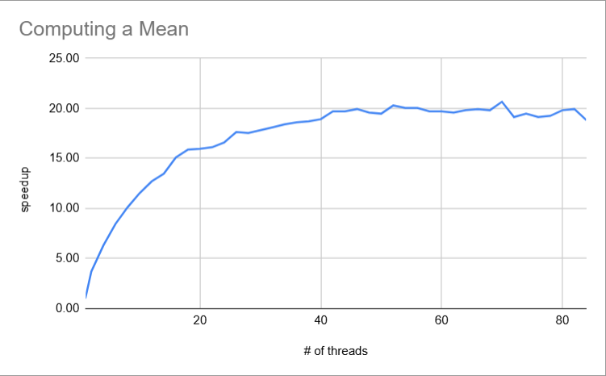
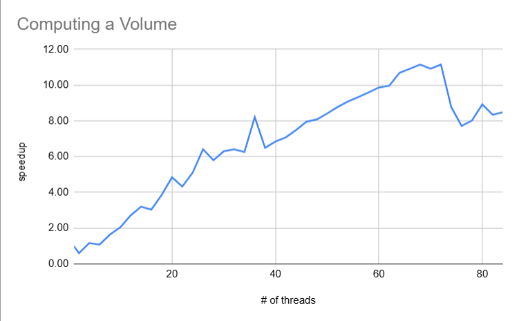

# Analysis and Reporting

## "Computing a Mean" Queations:
1. For the graph, note the shape of the curve. Does it “converge” to some general value?
What’s the maximum speedup you got from threading? What happens when you use more cores than are available in the hardware?  

The graph converges around 20 once it reaches 42 threads. When the program uses more cores than available, the speedup begins to fluctuate before dropping a little at the end.  

2. Considering the number of cores in the system, do you get a linear scaling of performance as you add more cores?  

There is not a linear scaling of performace as more cores are added, with speedup leveling off after 42 threads.

3. In parallel computation, there’s a maximum speed up you can achieve that’s described by Amdahl’s Law.
The law considers the time a program takes to run as the sum of the serial part (the part of the code that can’t or isn’t parallelized, like reading files),
and the parallelized part, which can mathematically be written as T = (1- p)T + pT where p is the percentage of the program that is parallelized.
When the parallel parts of the program are run using n threads, the timing becomes T = (1 - p)T + \frac{p}{n}T If you used an infinite number of processors, the \frac{p}{n}T
would approach zero, as the runtime is dominated by the serial part. You can see this on the graph, as adding more threads doesn’t continue to decrease the runtime.
Looking at your graph, what value would you proposed for p, and describe how you arrived at that value.  

Using the maximum speedup of 20.66 at 70 threads, I calculated:  
S = 1/((1-p) + p/n) => (1-p) + p/70 = 1/20.66 => 1-p(1-69/70) = 1/20.66 => p = (1-1/20.66)70/69 => p = 9.65. 

4. Finally, consider the kernel of the mean computation. How many bytes of data are required per iteration?
What’s the associated bandwidth used by the kernel? Is that value consistent when you consider threaded versions?

Each iteration of the mean computation requires 4 bytes of data due to data used being stored in an array of floats. The bandwidth with a single thread is 34GB/33.68s = 1.01GB/s. That value is not consistent with multiple threads, for example at 70 threads, the bandwidth per threads is 34GB/1.63s = 20.86GB/s.

## "Computing a Volume" Questions:
1. Do you get similar performance curve to threaded.out?

The performance curve is different, increasing somewhat linearly until dropping sharply after 72 threads.
